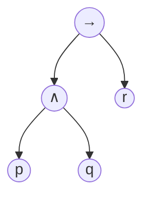
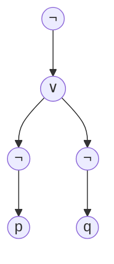

**Consider:**
- If it is a holiday or I am sick then I will not go to work
	- Therefore if I go to work then it's not a holiday and I am not sick
- For $x\in\mathbb{Z}$, if $x<-5$ or $x>5$ then $|x|>5$ 
	- Therefore if $|x|\ngtr 5$ then $x\nless 5$ and $x\ngtr 5$
- If **p** or **q**, then **r**. Therefore if not **r** then **not p** and **not q**

#### Proofs:
- Deduction - from premises to conclusions
- Induction - from specific premises to global conclusions

#### Systems of Logic:
- Propositional logic
- First-order logic (predicate logic)
- Second-order logic
- Higher-order logic

***
## Syntax

- Propositions or statements:
	- it is a holiday, i am sick, i will not go to work
	- Can be true or false but not both
- Propositional variables
	- p, q, r
- Not all assertions are propositions
- Not all sentences are assertions

### Formulae

- Symbols:
	- Propositional variable symbols $p,q,r$
	- Unary operation symbols $\neg$ called **negation**
	- Binary operation symbols $\wedge , \vee , \to$ called **conjunction, disjunction** and **implication**
	- Constant symbol $\perp$ called **falsity** or **contradiction**
	- Brackets $(, )$

### Backus Naur Form (BNF)

- BNF is standard in computer science for defining the grammar of the language
- A formula is a representation of a unique derivation in the BNF
- We will use $\varphi, \psi$ to range over well-bracketed terms built up from the grammar (fformulae)

### Trees

A tree is a mathematical structure that has nodes and edges
- There is a root node
- Each node has 0 or more children
	- nodes without children are leaves
- Each node that is not the root has exactly one parent
- There are no cycles

#### Abstract Syntax Trees:

### $(p\wedge q) \to r$

### $\neg(\neg p \vee \neg q)$

#### Syntactic Conventions

- $\neg$ Takes highest priority
- $\wedge, \vee$ take next priority
- $\to$ is lowest
	- $\neg p \wedge q \to r$  goes to $((\neg p) \wedge q) \to r$

