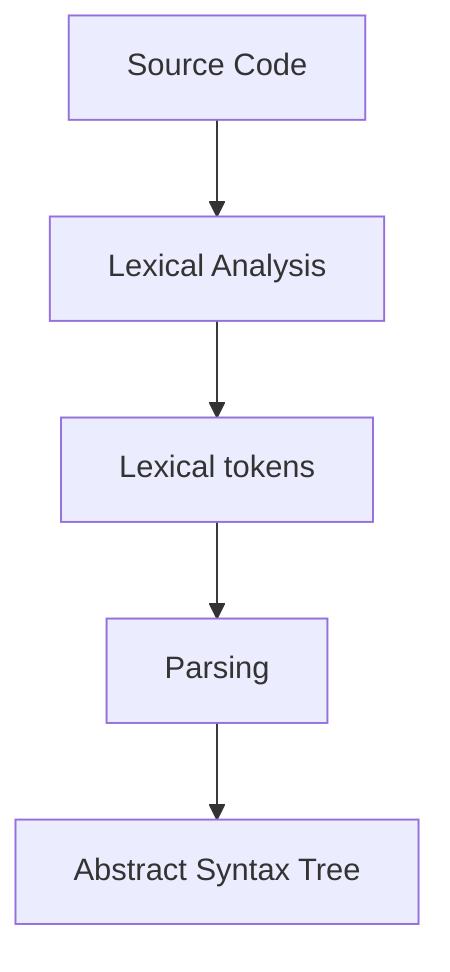

Key tool in compiler design

### Preview
- Finite Automata are machines which accept/ reject strings
- Thus they describe languages
- Regular expressions are another formalism for this
- Finite automate and regular expressions have the same expressive power

## Alphabets and Strings
- An Alphabet $\sum$ is any **finite set** (of **symbols**)
	- e.g. $\set{0,1},\set{a,b,c},\set{a,b,...,z},\set{0,1,...,9,+,\times}$
- A string over $\sum$ is a finite sequence of symbols $\sum$
	- e.g. $010101,abba,21+37$
- The length $\#$ of a string is the number of symbols it contains
	- e.g. $\#(abba) = 4$
- The empty string $\epsilon$ is a string, $\#(\epsilon) = 0$

### Properties of strings
- Two strings $s, t$ over $\sum$ are equal precisely if the contain the same symbols in the same order
- The set of all strings over $\sum$ is denoted $\sum^*$
- Every string either empty $\epsilon$ or of the form $x\sigma$ where $\sigma\in \sum$
- 'length' is then a function $\#:\sum^*\to\mathbb{N}$  where $\mathbb{N}$ is the set of the natural numbers $\set{0, 1, ...}$. We can define it using recursion:
	- $\#(\epsilon)=0$     $\#(x\sigma)=\#(x)+1$
### Concatenation
- Given two strings $s, t\in \sum^*$, their concatenation is denoted $st$
- Any string t satisfies the property that $\epsilon t = t\epsilon = t$
- We write $a^n$ for a string containing $n$ copies of $a$

## Languages
- A language over $\sum$ is a sub-set of $\sum^*$
- Two languages are equal when they contain the same strings

## Finite automata
- Given a language, can we algorithmically decide if a string belongs to it or not?
- Finite automata are the simplest machines which can do this

- State - a description of a system at some point in time
- Finite automata are systems with a finite number of states
- We will consider three variants of finite automata:
	- deterministic, nondeterministic and nondeterministic with $\epsilon$-moves

### Deterministic finite automaton
![[DFA.png | 400]]

- This is a DFA over the alphabet $\set{a,b}$ with two states, $0$, and $1$
- The arrows, labelled by symbols represent transitions, ie allowed moves
- 0 is a start state
- 1 is a final state

- An automaton accepts some strings and rejects others
- e.g. Accepts: $abbab, babbbab$ but rejects $abba, \epsilon$
**Formally:**
- A DFA $M = (Q,\Sigma,\delta,s,F):$
	- $Q$ is a finite set of states
	- $\sum$ is an alphabet
	- $\delta : Q \times \sum\to Q$ is the transition function
		- We will write $q\to q'$ for $\delta(q,a) = q'$
	- $s\in Q$ is the start state
	- $F \subseteq Q$ is the set of final states

![[formal dfa.png | 500]]

### Regular Languages
**Formal Definition:**
$$\text{For a DFA }\;M = (Q,\Sigma,\delta,s,F)\text{, its language }L(M)\;\text{is the set of all strings accepted by }M:$$
$$L(M)=\{x\in\Sigma^*\;|\;\exists f\in F.s\xrightarrow{x}f\}$$
**Explanation**
- $L(M)$ is the set of all strings that are accepted by a DFA $M$
- A language is regular when it is $L(M)$ for some DFA $M$

### Regular Language rules
Fix an alphabet $\Sigma$
- $\emptyset$ and $\Sigma^*$ are regular
- If $L$ is regular then the complement $\Sigma^*-L$ (sometimes written as $\sim L$) = $\set{x\in\Sigma^* | x \notin L}$ 
- If $L_1$ and $L_2$ are regular then $L_1 \cup L_2$ is regular
- If $L_1$ and $L_2$ are regular then $L_1 \cap L_2$ is regular
- If $L_1$ and $L_2$ are regular then their concatenation $L_1L_2 = \set{xy | x \in L_1, y\in L_2}$ is regular
- If $L$ is regular then its **Kleene star** $L^* = \set{x_1\ldots x_k | k \in\mathbb{N},x_i\in L}$ is regular 

### Products of automata
- The product construction is useful for proving some of the properties above
- If $M_1$ and $M_2$ are DFAs over $\Sigma$, then $M_1 \times M_2$ is the DFA that simulates running $M_1$ and $M_2$ **in parallel**

![[Product construction.png | 400]]
**Formally**
- $M_1 = (Q_1, \Sigma_1, \delta_1, s_1, F_1)$ and $M_2 = (Q_2, \Sigma_2, \delta_2, s_2, F_2)$, let $M_3$ be defined:
	- $Q_3\stackrel{\text{def}}{=}Q_1\times Q_2$,         $\delta_3((q_1, q_2),\sigma)\stackrel{\text{def}}{=}(\delta(q_1, \sigma),\delta_2(q_2,\sigma))$ 
	- $s_3 \stackrel{\text{def}}{=} (s_1, s_2)$,            $F_3\stackrel{\text{def}}{=} F_1 \times F_2$ 
- Claim $L(M_3) = L(M_1) \cap L(M_2)$ 